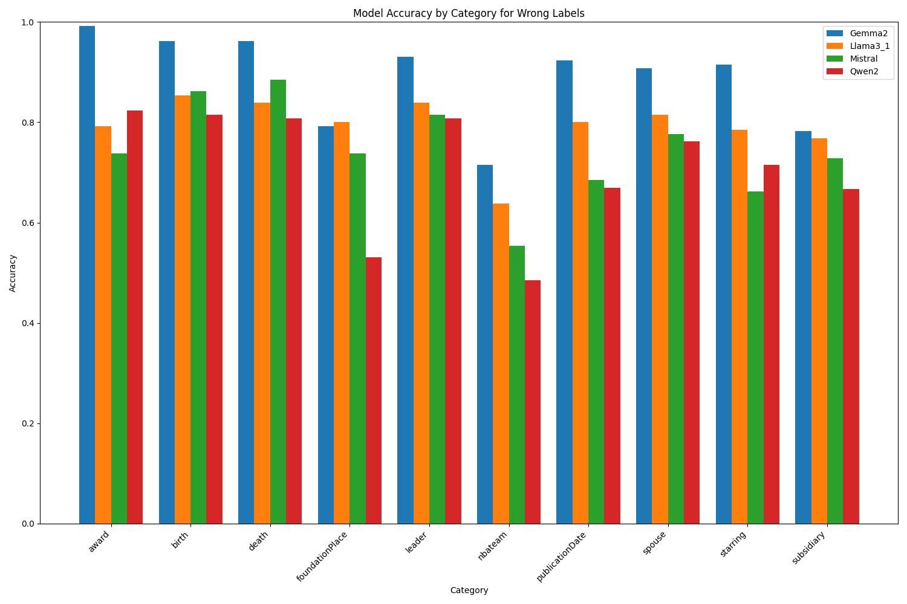
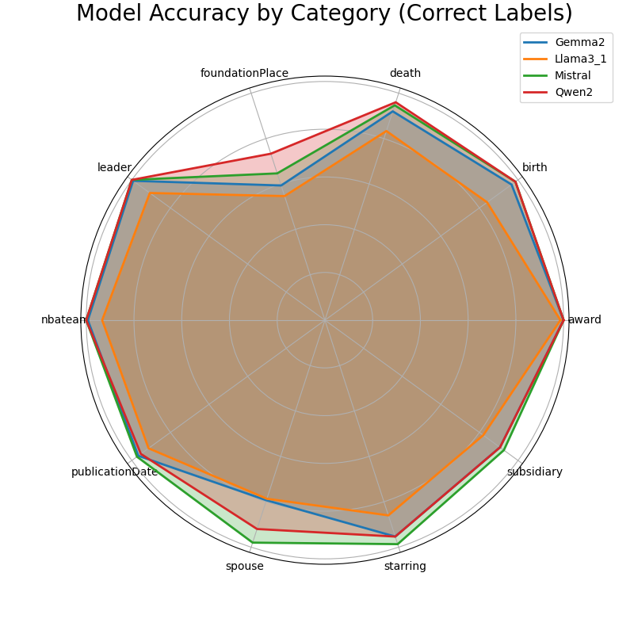
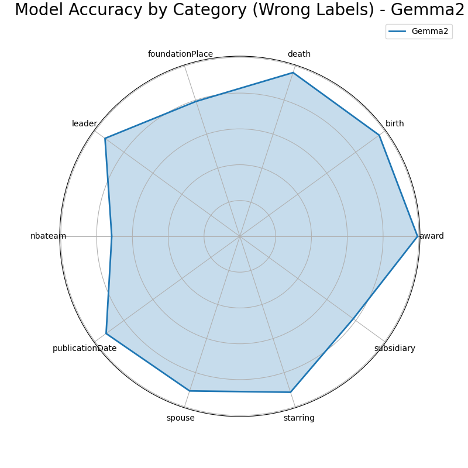
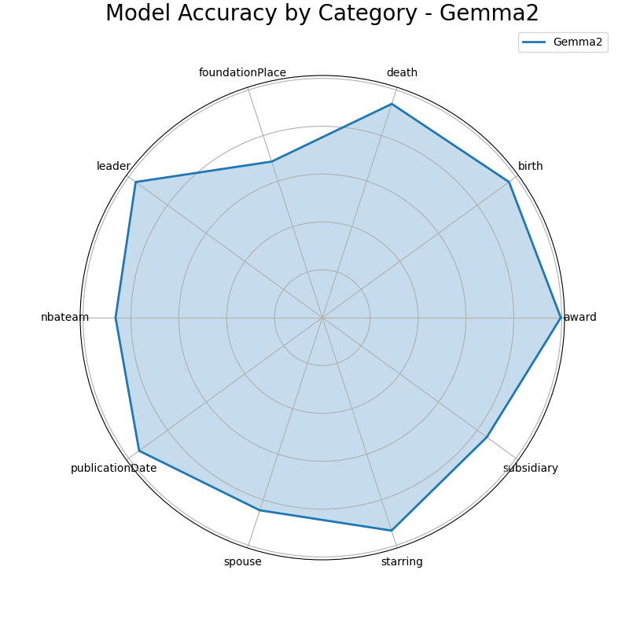
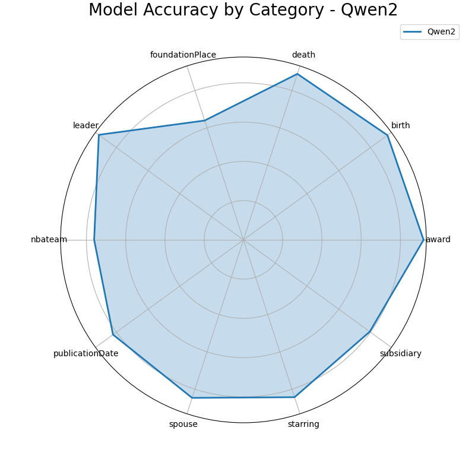
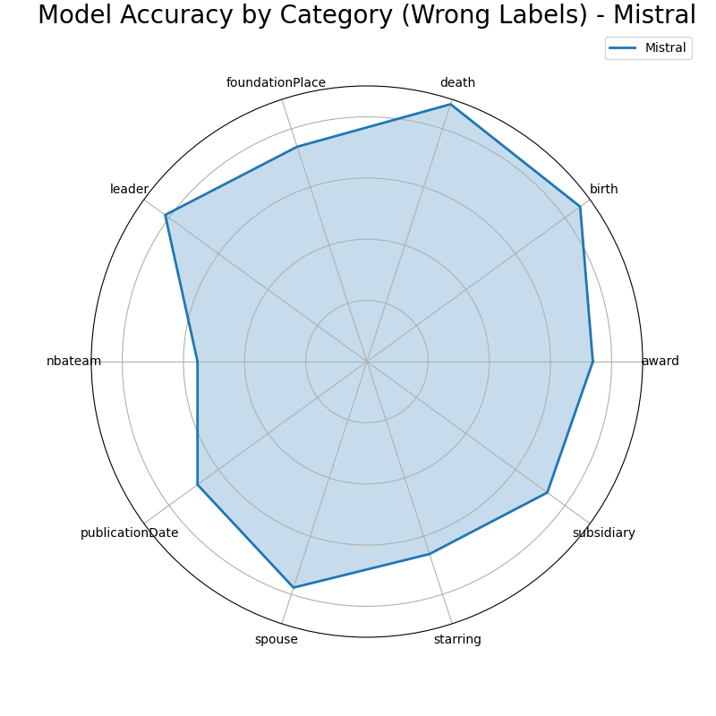

# Model Accuracy Charts

## Results - Accuracy

    
    

    

## Results

    
    
    

---
## Results By LLM
### Gemma 2

    
    
    

### Llama 3.1

    
    
    

### Qwen 2

    
    
    

### Mistral

    
    
    

Todo:
- [ ] Fix the issue related to empty `questions.json`
- [ ] Fix the issue related to empty `all_docs` folder and see why it cannot receive any data
- [ ] Fix the code in the `main.py` and make it parametrized
- [ ] Fix related issues to RAG indexing mechanism
- [ ] Run for all the Knowledge Graphs.

- [ ] Share the results with the team and discuss the results.
