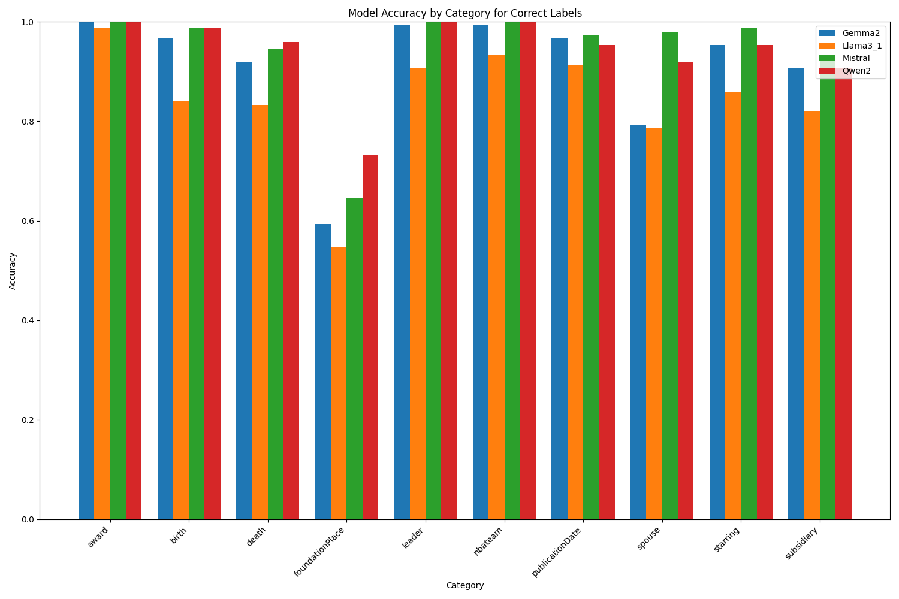
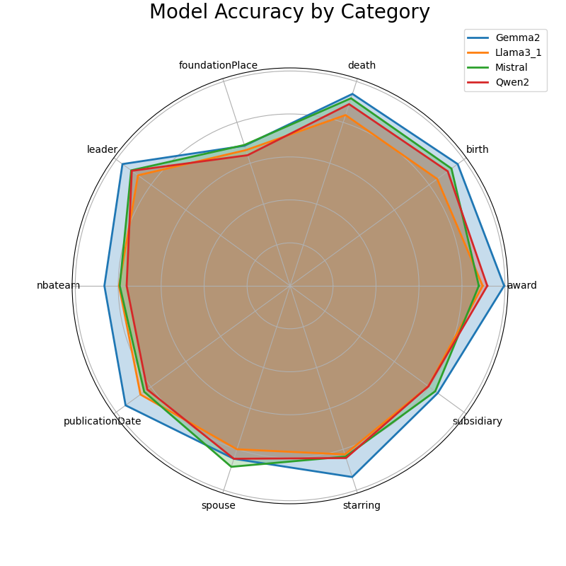
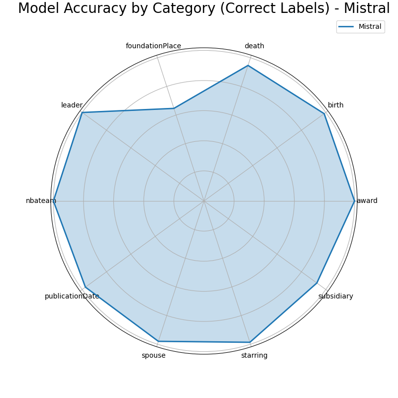
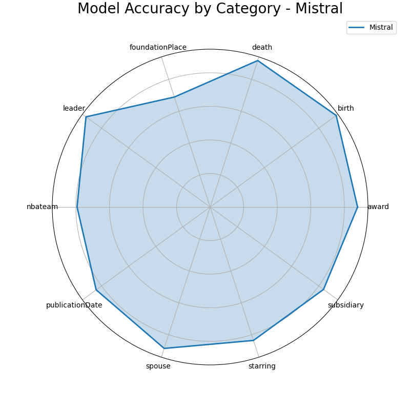

# Results
### Model Accuracy by Category (Correct Labels)

| Model     | death | award | nbateam | spouse | birth | foundationPlace | starring | leader | publicationDate | subsidiary | Total |
|-----------|----------|----------|----------|----------|----------|----------|----------|----------|----------|----------|----------|
| Gemma2 | 0.92 | 1.00 | 0.99 | 0.79 | 0.97 | 0.59 | 0.95 | 0.99 | 0.97 | 0.91 | 0.91 |
| Llama3_1 | 0.83 | 0.99 | 0.93 | 0.79 | 0.84 | 0.55 | 0.86 | 0.91 | 0.91 | 0.82 | 0.84 |
| Mistral | 0.95 | 1.00 | 1.00 | 0.98 | 0.99 | 0.65 | 0.99 | 1.00 | 0.97 | 0.93 | 0.94 |
| Qwen2 | 0.96 | 1.00 | 1.00 | 0.92 | 0.99 | 0.73 | 0.95 | 1.00 | 0.95 | 0.91 | 0.94 |

### Model Accuracy by Category (Wrong Labels)

| Model     | starring | death | award | nbateam | spouse | birth | foundationPlace | leader | publicationDate | subsidiary | Total |
|-----------|----------|----------|----------|----------|----------|----------|----------|----------|----------|----------|----------|
| Gemma2 | 0.92 | 0.96 | 0.99 | 0.72 | 0.91 | 0.96 | 0.79 | 0.93 | 0.92 | 0.78 | 0.89 |
| Llama3_1 | 0.78 | 0.84 | 0.79 | 0.64 | 0.82 | 0.85 | 0.80 | 0.84 | 0.80 | 0.77 | 0.79 |
| Mistral | 0.66 | 0.88 | 0.74 | 0.55 | 0.78 | 0.86 | 0.74 | 0.82 | 0.68 | 0.73 | 0.74 |
| Qwen2 | 0.72 | 0.81 | 0.82 | 0.48 | 0.76 | 0.82 | 0.53 | 0.81 | 0.67 | 0.67 | 0.71 |

### Model Accuracy by Category

| Model     | starring | death | award | nbateam | spouse | birth | foundationPlace | leader | publicationDate | subsidiary | Total |
|-----------|----------|----------|----------|----------|----------|----------|----------|----------|----------|----------|----------|
| Gemma2 | 0.94 | 0.94 | 1.00 | 0.86 | 0.85 | 0.96 | 0.69 | 0.96 | 0.95 | 0.85 | 0.90 |
| Llama3_1 | 0.82 | 0.84 | 0.90 | 0.80 | 0.80 | 0.85 | 0.66 | 0.88 | 0.86 | 0.80 | 0.82 |
| Mistral | 0.84 | 0.92 | 0.88 | 0.79 | 0.89 | 0.93 | 0.69 | 0.91 | 0.84 | 0.84 | 0.85 |
| Qwen2 | 0.84 | 0.89 | 0.92 | 0.76 | 0.85 | 0.91 | 0.64 | 0.91 | 0.82 | 0.80 | 0.83 |

---
# Charts

## BarChart

    
    

    

## Radar

    
    
    

---
## Results By LLM

### Gemma 2

    
    
    

### Llama 3.1

    
    
    

### Qwen 2

    
    
    

### Mistral

    
    
    

Todo:
- [ ] Fix the issue related to empty `questions.json`
- [ ] Fix the issue related to empty `all_docs` folder and see why it cannot receive any data
- [ ] Fix the code in the `main.py` and make it parametrized
- [ ] Fix related issues to RAG indexing mechanism
- [ ] Run for all the Knowledge Graphs.

- [ ] Share the results with the team and discuss the results.
