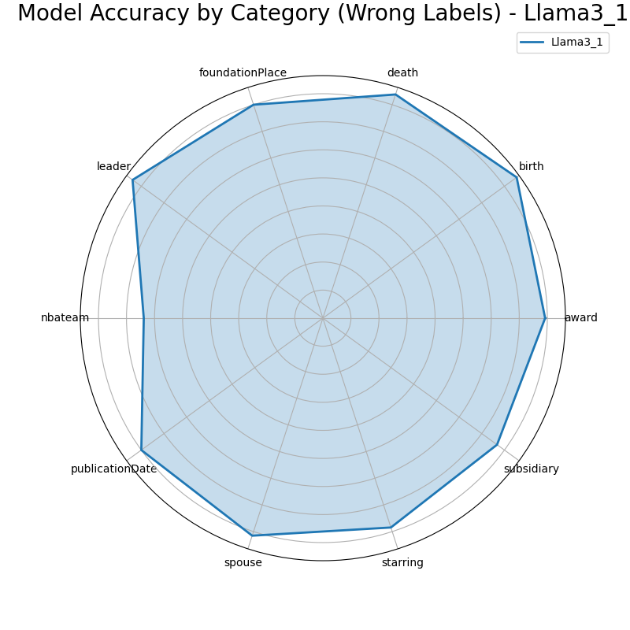
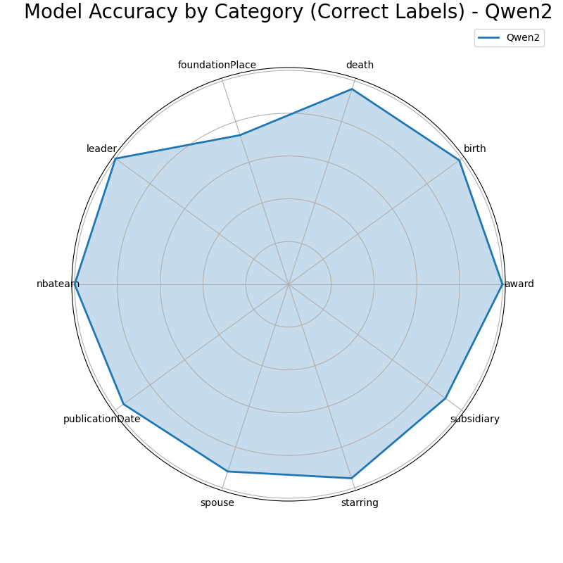
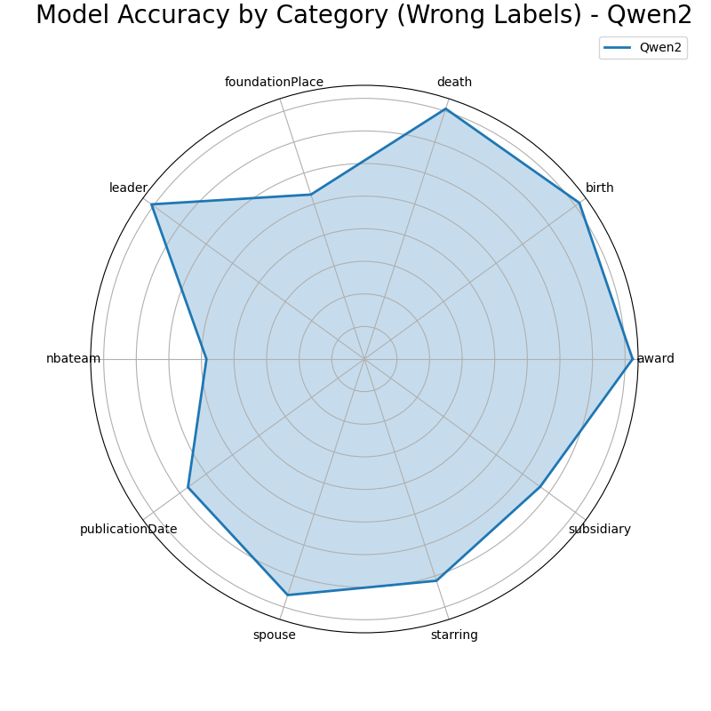

# Results

### Models

- Gemma 2: Google Gemma 2 is a high-performing and efficient model by now available in three sizes: 2B, 9B, and 27B. (We use 9B) 
- Llama 3.1: Llama 3.1 is a new state-of-the-art model from Meta available in 8B, 70B and 405B parameter sizes. (We use 8B)
- Mistral: 7B model released by Mistral AI.
- Qwen 2: Qwen2 is a new series of large language models from Alibaba group. (We use 7B)

### Model Accuracy by Category (Correct Labels)

| Model     | award | birth | death | foundationPlace | leader | nbateam | publicationDate | spouse | starring | subsidiary | Total |
|-----------|----------|----------|----------|----------|----------|----------|----------|----------|----------|----------|----------|
| Gemma2 | **1.00** | 0.97 | 0.92 | 0.59 | 0.99 | 0.99 | **0.97** | 0.79 | 0.95 | 0.91 | 0.91 |
| Llama3_1 | 0.99 | 0.84 | 0.83 | 0.55 | 0.91 | 0.93 | 0.91 | 0.79 | 0.86 | 0.82 | 0.84 |
| Mistral | **1.00** | **0.99** | **0.95** | 0.65 | **1.00** | **1.00** | **0.97** | **0.98** | **0.99** | **0.93** | **0.94** |
| Qwen2 | **1.00** | **0.99** | **0.96** | **0.73** | **1.00** | **1.00** | 0.95 | 0.92 | 0.95 | 0.91 | **0.94** |

### Model Accuracy by Category (Wrong Labels)

| Model     | award | birth | death | foundationPlace | leader | nbateam | publicationDate | spouse | starring | subsidiary | Total |
|-----------|----------|----------|----------|----------|------|----------|----------|----------|----------|----------|----------|
| Gemma2 | **0.99** | **0.96** | **0.96** | 0.79 | **0.93** | **0.72** | **0.92** | **0.91** | **0.92** | **0.78** | **0.89** |
| Llama3_1 | 0.79 | 0.85 | 0.84 | **0.80** | 0.84 | 0.64 | 0.80 | 0.82 | 0.78 | 0.77 | 0.79 |
| Mistral | 0.74 | 0.86 | 0.88 | 0.74 | 0.82 | 0.55 | 0.68 | 0.78 | 0.66 | 0.73 | 0.74 |
| Qwen2 | 0.82 | 0.82 | 0.81 | 0.53 | 0.81 | 0.48 | 0.67 | 0.76 | 0.72 | 0.67 | 0.71 |

### Model Accuracy by Category

| Model    | award    | birth  | death | foundationPlace | leader | nbateam | publicationDate | spouse | starring | subsidiary | Total |
|----------|----------|--------|----------|--------|----------|----------|----------|----------|----------|----------|-------|
| Gemma2   | **1.00** | **0.96** | **0.94** | **0.69** | **0.96** | **0.86** | **0.95** | 0.85 | **0.94** | **0.85** | **0.90**  |
| Llama3_1 | 0.90     | 0.85   | 0.84 | 0.66 | 0.88 | 0.80 | 0.86 | 0.80 | 0.82 | 0.80 | 0.82  |
| Mistral  | 0.88     | 0.93   | 0.92 | **0.69** | 0.91 | 0.79 | 0.84 | **0.89** | 0.84 | 0.84 | 0.85  |
| Qwen2    | 0.92     | 0.91   | 0.89 | 0.64 | 0.91 | 0.76 | 0.82 | 0.85 | 0.84 | 0.80 | 0.83  |
| Combined | 0.92     | 0.91   | 0.89 | 0.64 | 0.91 | 0.76 | 0.82 | 0.85 | 0.84 | 0.80 | 0.85  |

---
# Charts

## BarChart

    
    

    

## Radar

    
    
    

---
## Results By LLM

### Gemma 2

    
    
    

### Llama 3.1

    
    
    

### Qwen 2

    
    
    

### Mistral

    
    
    

---
## Proposal
### Guidelines for Combining and Evaluating LLM Responses

#### 1. Combine Responses from Multiple LLMs
- Gather results from at least four different language models (LLMs).
- If at least three out of the four models agree on a particular response, use that consensus as the final answer.

#### 2. Handling Disagreements
- If there is no clear majority (fewer than three out of four models agree), consult an additional LLM, such as GPT-4 or another commercial model, to provide further context and insights.

#### 3. Incorporate Humanized Guidelines
- Apply guidelines to ensure more accurate and relevant responses. For example:
    - **Spouse - Personal Matters (e.g., Divorce):** Focus on all the data rather than today details.
    - **Death-Related Queries:** Prioritize the place where the person passed away, rather than where they were buried.

This approach aims to provide clear, well-supported answers while incorporating human-like considerations for context.

### Combination Result - W/O 2-3 Phases

| Model    | award    | birth  | death    | foundationPlace | leader   | nbateam  | publicationDate | spouse | starring | subsidiary | Total |
|----------|----------|--------|----------|--------|----------|----------|-----------------|----------|----------|------------|-------|
| Gemma2   | **1.00** | **0.96** | **0.94** | **0.69** | **0.96** | **0.86** | **0.95**        | 0.85 | **0.94** | **0.85**   | **0.90**  |
| Llama3_1 | 0.90     | 0.85   | 0.84     | 0.66 | 0.88     | 0.80     | 0.86            | 0.80 | 0.82     | 0.80       | 0.82  |
| Mistral  | 0.88     | 0.93   | 0.92     | **0.69** | 0.91     | 0.79     | 0.84            | **0.89** | 0.84     | 0.84       | 0.85  |
| Qwen2    | 0.92     | 0.91   | 0.89     | 0.64 | 0.91     | 0.76     | 0.82            | 0.85 | 0.84     | 0.80       | 0.83  |
| Proposal | 0.92     | 0.91   | 0.90     | 0.64 | 0.93     | 0.80     | 0.87            | 0.85 | 0.85     | 0.83       | 0.85  |

**NOTE**: Disagreement Handling for `179 Items`
- For 179 Items, there are 2 correct labels and 2 incorrect labels, this items should be addressed in the disagreement handling process, By addressing these disagreements, the model's accuracy and reliability are improved.

**CONCLUSION**:
The result is 0.85 now, it might go higher after `Disagreement Handling` and for sure it become `AT LEAST THE SECOND TOP MODEL`.

---

Todo:
- [ ] Fix the issue related to empty `questions.json`
- [ ] Fix the issue related to empty `all_docs` folder and see why it cannot receive any data
- [ ] Fix the code in the `main.py` and make it parametrized
- [ ] Fix related issues to RAG indexing mechanism
- [ ] Run for all the Knowledge Graphs.

- [ ] Share the results with the team and discuss the results.

fix the ordering in the category names to have understanding chart